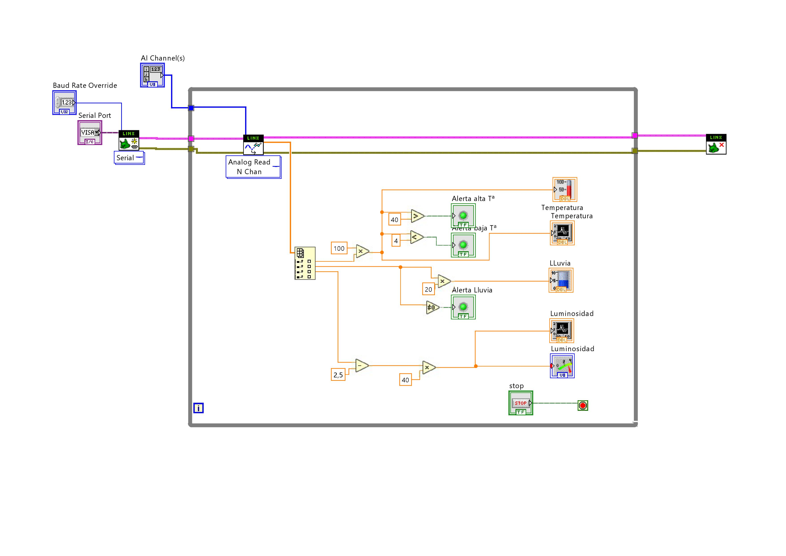
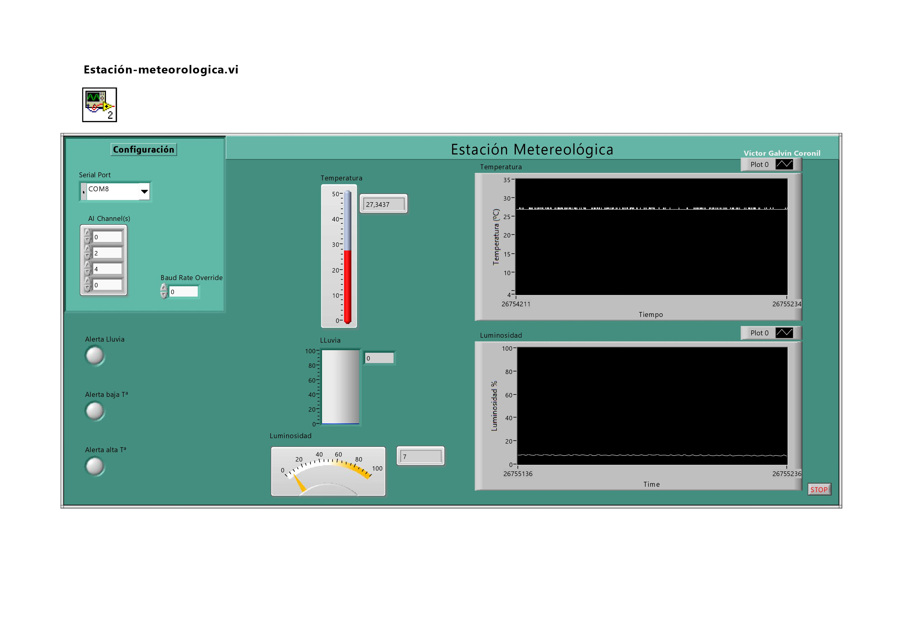
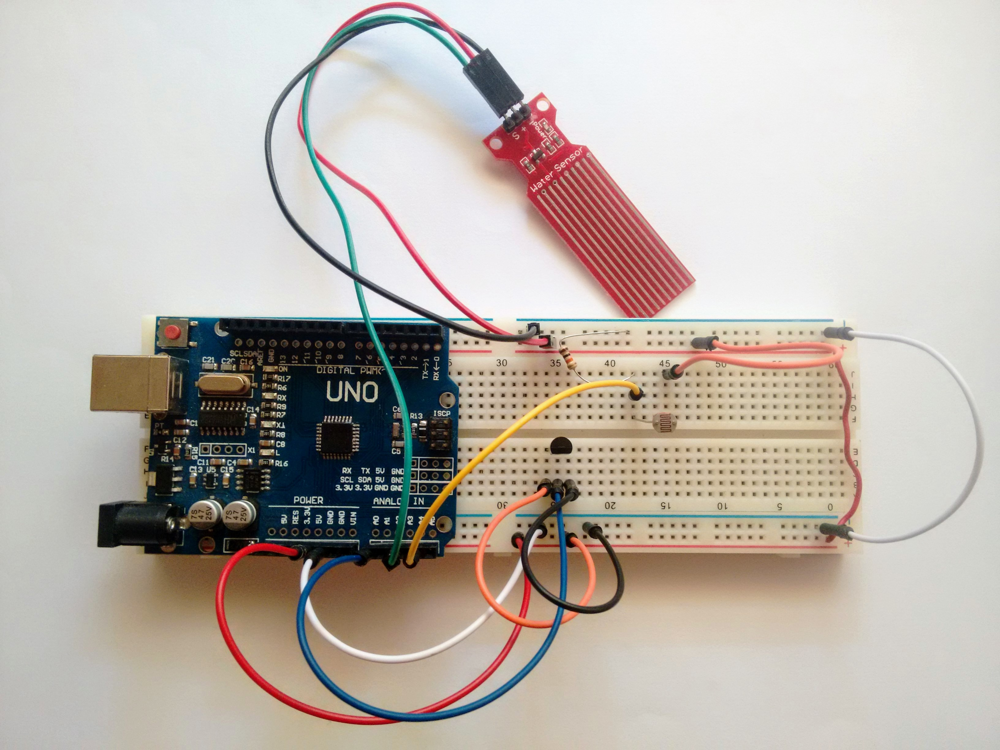

# Estacion meteorológica en LabView
Pequeña estación meteorológica para mostrar el uso de Arduino como dispositivo de adquisición de datos (DAQ) en el software de intrumentación virtual [LabView.](http://www.ni.com/es-mx/shop/labview.html)

